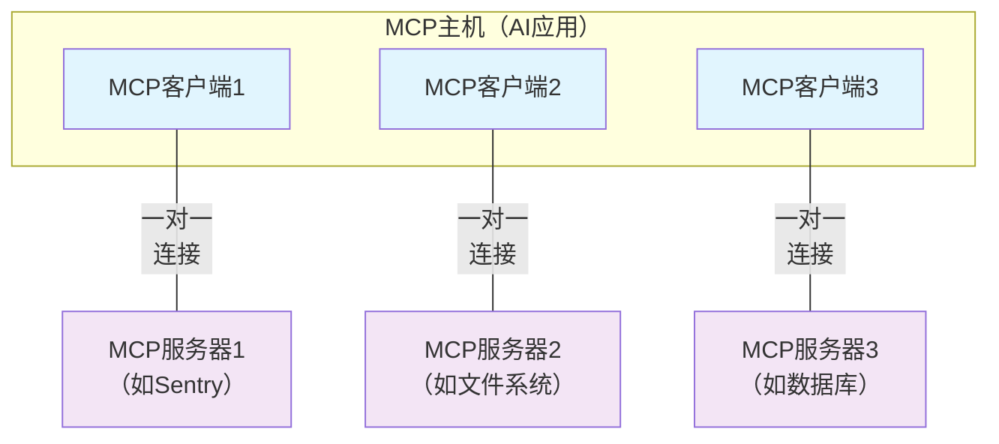

本文档概述了模型上下文协议（MCP），讨论了其[范围](#scope)和[核心概念](#concepts-of-mcp)，并通过[示例](#example)演示每个核心概念。

由于MCP SDK已抽象化许多技术细节，大多数开发者可能会发现[数据层协议](#data-layer-protocol)部分最为实用。该部分阐述了MCP服务器如何为AI应用提供上下文。

具体实现细节，请参阅您所用编程语言的[SDK文档](/docs/sdk)。

## 范围

模型上下文协议包含以下项目：

- [MCP规范](https://modelcontextprotocol.io/specification/latest)：详细规定客户端和服务端实现要求的协议规范
- [MCP SDK](/docs/sdk)：支持多种编程语言的协议实现开发包
- **MCP开发工具**：用于开发MCP服务端与客户端的工具集，包含[MCP检测器](https://github.com/modelcontextprotocol/inspector)
- [MCP参考服务端实现](https://github.com/modelcontextprotocol/servers)：MCP服务端的参考实现

<Note>
  MCP仅专注于上下文交换协议——不限定AI应用如何使用大语言模型或管理所获得的上下文。
</Note>

## MCP核心概念
### 参与者

MCP采用客户端-服务器架构，其中MCP主机（如[Claude Code](https://www.anthropic.com/claude-code)或[Claude Desktop](https://www.claude.ai/download)等AI应用）会与一个或多个MCP服务器建立连接。MCP主机通过为每个MCP服务器创建对应的MCP客户端来实现这一机制。每个MCP客户端都会与其对应的MCP服务器保持专属的一对一连接。

MCP架构中的核心参与者包括：

- **MCP主机**：协调管理一个或多个MCP客户端的AI应用程序
- **MCP客户端**：维护与MCP服务器连接的组件，负责从MCP服务器获取上下文供主机使用
- **MCP服务器**：为客户端提供上下文数据的程序

**例如**：Visual Studio Code作为MCP主机运行时，当它连接到[Sentry MCP服务器](https://docs.sentry.io/product/sentry-mcp/)时，VS Code运行时会实例化一个MCP客户端对象来维护该连接。当VS Code再连接到[本地文件系统服务器](https://github.com/modelcontextprotocol/servers/tree/main/src/filesystem)时，又会实例化另一个独立的MCP客户端对象，从而始终保持客户端与服务器之间的一对一对应关系。



需要注意的是，**MCP服务器**指的是提供上下文数据的程序，无论其运行位置。MCP服务器既可在本地运行也可远程部署。例如当Claude Desktop启动[文件系统服务器](https://github.com/modelcontextprotocol/servers/tree/main/src/filesystem)时，由于采用STDIO传输协议，该服务器实际运行在本地机器上，这类通常称为"本地"MCP服务器。而官方的[Sentry MCP服务器](https://docs.sentry.io/product/sentry-mcp/)运行在Sentry平台，采用Streamable HTTP传输协议，这类则称为"远程"MCP服务器。

### 层级结构

MCP协议包含两个层级：

- **数据层**：定义基于JSON-RPC的客户端-服务器通信协议，包括生命周期管理和核心原语（如工具、资源、提示和通知）
- **传输层**：定义实现数据交换的通信机制与通道，包括特定传输协议的连接建立、消息帧处理和授权验证

从概念上看，数据层是内层，而传输层构成外层结构。
#### 数据层

数据层实现了基于[JSON-RPC 2.0](https://www.jsonrpc.org/)的交换协议，定义了消息结构与语义。该层包含以下功能：

- **生命周期管理**：处理客户端与服务器之间的连接初始化、能力协商及连接终止
- **服务器功能**：使服务器能提供核心功能，包括AI动作工具、上下文数据资源以及与客户端交互的提示模板
- **客户端功能**：允许服务器要求客户端从宿主大语言模型采样、向用户获取输入、并向客户端记录消息
- **实用功能**：支持实时更新通知、长时操作进度追踪等附加能力

#### 传输层

传输层管理客户端与服务器间的通信通道及认证机制，负责建立连接、消息分帧以及MCP参与者间的安全通信。

MCP支持两种传输机制：

- **标准输入输出传输**：通过本地进程间的标准输入输出流进行通信，无网络开销且性能最优
- **可流式HTTP传输**：使用HTTP POST传递客户端到服务器的消息，并可选配服务器推送事件实现流式传输。该机制支持远程服务器通信，兼容标准HTTP认证方式（包括Bearer令牌、API密钥及自定义头）。MCP推荐使用OAuth获取认证令牌

传输层对协议层屏蔽通信细节，使得所有传输机制均可使用相同的JSON-RPC 2.0消息格式。

### 数据层协议

MCP的核心在于定义客户端与服务器间的模式与语义。开发者最感兴趣的部分很可能是数据层——尤其是[基础元素](#primitives)集合，这部分定义了开发者如何通过MCP服务器向客户端共享上下文。

MCP采用[JSON-RPC 2.0](https://www.jsonrpc.org/)作为底层RPC协议。客户端与服务器相互发送请求并作出响应，无需响应时可采用通知机制。

#### 生命周期管理

MCP属于<Tooltip tip="使用可流式HTTP传输可实现MCP子集的无状态化">有状态协议</Tooltip>，需要进行生命周期管理。其核心目的是协商<Tooltip tip="客户端或服务器支持的功能与操作，如工具、资源或提示等">能力集</Tooltip>。详细信息可参阅[规范文档](/specification/2025-06-18/basic/lifecycle)，[示例](#example)部分展示了初始化流程。
#### 基础组件

MCP基础组件是MCP中最核心的概念，它们定义了客户端与服务器之间能够提供的交互能力。这些组件明确了可以分享给AI应用的上下文信息类型，以及可执行的操作范围。

MCP为_服务器_定义了三种核心基础组件：

- **工具**：可执行函数，AI应用可调用这些函数执行操作（例如文件操作、API调用、数据库查询）
- **资源**：为AI应用提供上下文信息的数据源（例如文件内容、数据库记录、API响应）
- **提示模板**：可复用的交互模板，用于构建与语言模型的交互（例如系统提示、少量示例）

每种基础组件类型都关联着发现(`*/list`)、获取(`*/get`)方法，部分还包含执行(`tools/call`)方法。MCP客户端会先通过`*/list`方法发现可用组件。例如客户端可以先列出所有可用工具(`tools/list`)再执行它们，这种设计使得列表能动态更新。

具体示例：假设一个提供数据库上下文的MCP服务器，它可以暴露查询数据库的工具、包含数据库模式的资源，以及包含工具交互示例的提示模板。

更多服务器基础组件细节详见[服务器概念](./server-concepts)。

MCP同样定义了_客户端_可暴露的基础组件，这些组件让MCP服务端开发者能构建更丰富的交互：

- **采样**：允许服务端从客户端的AI应用请求语言模型补全。当服务端开发者需要语言模型能力但希望保持模型独立性、不在MCP服务端集成语言模型SDK时，可通过`sampling/complete`方法向客户端AI应用发起请求。
- **引导**：允许服务端向用户请求额外信息。当需要获取更多用户输入或确认操作时，可通过`elicitation/request`方法发起请求。
- **日志**：支持服务端向客户端发送日志消息用于调试和监控。

更多客户端基础组件细节详见[客户端概念](./client-concepts)。

#### 通知机制

该协议支持实时通知机制，实现服务端与客户端间的动态更新。例如当服务器可用工具发生变化时（新增功能或现有工具修改），服务端可以通过工具更新通知告知连接的客户端。这些通知以JSON-RPC 2.0通知消息形式发送（不期待响应），使MCP服务端能向连接的客户端提供实时更新。

## 示例
### 数据层

本节逐步演示MCP客户端与服务端的交互过程，重点解析数据层协议。我们将通过JSON-RPC 2.0消息展示生命周期序列、工具操作和通知机制。

<步骤>
<步骤标题="初始化（生命周期管理）">

MCP通过能力协商握手开启生命周期管理。如[生命周期管理](#lifecycle-management)章节所述，客户端发送`initialize`请求建立连接并协商支持的功能特性。

<代码组>
  ```json 请求示例
  {
    "jsonrpc": "2.0",
    "id": 1,
    "method": "initialize",
    "params": {
      "protocolVersion": "2025-06-18",
      "capabilities": {
        "elicitation": {}
      },
      "clientInfo": {
        "name": "example-client",
        "version": "1.0.0"
      }
    }
  }
  ```
  ```json 响应示例
  {
    "jsonrpc": "2.0",
    "id": 1,
    "result": {
      "protocolVersion": "2025-06-18",
      "capabilities": {
        "tools": {
          "listChanged": true
        },
        "resources": {}
      },
      "serverInfo": {
        "name": "example-server",
        "version": "1.0.0"
      }
    }
  }
  ```
</代码组>


#### 初始化交换流程解析

初始化过程是MCP生命周期管理的核心环节，主要实现以下功能：

1. **协议版本协商**：通过`protocolVersion`字段（如"2025-06-18"）确保双方使用兼容的协议版本。若无法达成版本一致，则应终止连接以避免通信错误。

2. **能力发现**：`capabilities`对象声明各方支持的功能特性，包括能处理的[基础元素](#primitives)（工具、资源、提示等）以及是否支持[通知机制](#notifications)。这种预先声明可避免后续无效操作。

3. **身份信息交换**：`clientInfo`和`serverInfo`对象提供身份标识和版本信息，便于调试和兼容性检查。

本例中的能力协商展示了MCP基础元素的声明方式：

**客户端能力**：
- `"elicitation": {}` - 声明可处理用户交互请求（能接收`elicitation/create`方法调用）

**服务端能力**：
- `"tools": {"listChanged": true}` - 支持工具基础元素且能发送`tools/list_changed`通知（当工具列表变更时）
- `"resources": {}` - 支持资源基础元素（能处理`resources/list`和`resources/read`方法）

成功初始化后，客户端发送就绪通知：

```json 通知示例
{
  "jsonrpc": "2.0",
  "method": "notifications/initialized"
}
```


#### 在AI应用中的实现原理

AI应用的MCP客户端管理器在初始化阶段会连接配置的服务器，并存储其能力信息以供后续使用。应用程序通过这些信息判断哪些服务器能提供特定功能（工具、资源、提示等），以及是否支持实时更新。

```python AI应用初始化的伪代码示例
# 伪代码  
async with stdio_client(server_config) as (read, write):  
    async with ClientSession(read, write) as session:  
        init_response = await session.initialize()  
        if init_response.capabilities.tools:  
            app.register_mcp_server(session, supports_tools=True)  
        app.set_server_ready(session)  
```  

</Step>  

<Step title="工具发现（基础）">  
连接建立后，客户端可通过发送 `tools/list` 请求来发现可用工具。该请求是MCP工具发现机制的核心——它让客户端在使用工具前了解服务器提供了哪些功能。  

<CodeGroup>  
  ```json 请求  
  {  
    "jsonrpc": "2.0",  
    "id": 2,  
    "method": "tools/list"  
  }  
  ```  
  ```json 响应  
  {  
    "jsonrpc": "2.0",  
    "id": 2,  
    "result": {  
      "tools": [  
        {  
          "name": "calculator_arithmetic",  
          "title": "计算器",  
          "description": "执行数学运算，包括基础算术、三角函数和代数运算",  
          "inputSchema": {  
            "type": "object",  
            "properties": {  
              "expression": {  
                "type": "string",  
                "description": "待计算的数学表达式（如'2 + 3 * 4'、'sin(30)'、'sqrt(16)'）"  
              }  
            },  
            "required": ["expression"]  
          }  
        },  
        {  
          "name": "weather_current",  
          "title": "天气查询",  
          "description": "获取全球任意地点的实时天气信息",  
          "inputSchema": {  
            "type": "object",  
            "properties": {  
              "location": {  
                "type": "string",  
                "description": "城市名称、地址或坐标（纬度,经度）"  
              },  
              "units": {  
                "type": "string",  
                "enum": ["metric", "imperial", "kelvin"],  
                "description": "返回结果使用的温度单位",  
                "default": "metric"  
              }  
            },  
            "required": ["location"]  
          }  
        }  
      ]  
    }  
  }  
  ```  
</CodeGroup>  

#### 理解工具发现请求  
`tools/list` 请求结构简单，不包含任何参数。  

#### 理解工具发现响应  
响应中的 `tools` 数组提供了每个可用工具的完整元数据。这种基于数组的结构允许服务器同时暴露多个工具，同时保持不同功能之间的清晰界限。  

响应中的每个工具对象包含以下关键字段：  
- **`name`**：工具在服务器命名空间内的唯一标识符，作为执行工具的主键，应遵循清晰的命名模式（例如使用`calculator_arithmetic`而非简单的`calculate`）  
- **`title`**：面向用户的可读工具名称  
- **`description`**：详细说明工具功能及适用场景  
- **`inputSchema`**：定义输入参数的JSON Schema，支持类型校验并明确标注必填/可选参数  

#### 在AI应用中的运作原理  
AI应用从所有连接的MCP服务器获取可用工具，并将其整合到语言模型可访问的统一工具注册表中。这使得LLM能够理解可执行的操作，并在对话过程中自动生成适当的工具调用。  

```python AI应用工具发现的伪代码
# 使用MCP Python SDK模式的伪代码  
available_tools = []  
for session in app.mcp_server_sessions():  
    tools_response = await session.list_tools()  
    available_tools.extend(tools_response.tools)  
conversation.register_available_tools(available_tools)  
```  

</Step>  

<Step title="工具执行（基础操作）">  
客户端现在可以通过`tools/call`方法执行工具。这展示了MCP基础操作的实际应用：在发现可用工具后，客户端可以用合适的参数调用它们。  

#### 理解工具执行请求  

`tools/call`请求遵循结构化格式，确保客户端与服务器之间的类型安全和清晰通信。注意我们使用的是发现响应中的准确工具名称（`weather_current`），而非简化名称：  

<CodeGroup>  
  ```json 请求  
  {  
    "jsonrpc": "2.0",  
    "id": 3,  
    "method": "tools/call",  
    "params": {  
      "name": "weather_current",  
      "arguments": {  
        "location": "San Francisco",  
        "units": "imperial"  
      }  
    }  
  }  
  ```  
  ```json 响应  
  {  
    "jsonrpc": "2.0",  
    "id": 3,  
    "result": {  
      "content": [  
        {  
          "type": "text",  
          "text": "旧金山当前天气：68°F，局部多云，西风轻拂，风速8英里/小时。湿度：65%"  
        }  
      ]  
    }  
  }  
  ```  
</CodeGroup>  

#### 工具执行的关键要素  

请求结构包含几个重要组成部分：  

1. **`name`**：必须与发现响应中的工具名称完全匹配（`weather_current`）。这确保服务器能正确识别要执行的工具。  

2. **`arguments`**：包含工具`inputSchema`定义的输入参数。本例中：  
   - `location`："San Francisco"（必填参数）  
   - `units`："imperial"（可选参数，未指定时默认为"metric"）  

3. **JSON-RPC结构**：使用标准JSON-RPC 2.0格式，带有唯一的`id`用于请求-响应关联。  

#### 理解工具执行响应  

响应展示了MCP灵活的内容系统：  

1. **`content`数组**：工具响应返回一个内容对象数组，支持丰富多样的响应格式（文本、图像、资源等）。  

2. **内容类型**：每个内容对象都有`type`字段。本例中`"type": "text"`表示纯文本内容，但MCP支持多种内容类型以满足不同用例。  

3. **结构化输出**：响应提供了可操作的信息，AI应用可将其用作语言模型交互的上下文。  

这种执行模式允许AI应用动态调用服务器功能，并接收可集成到语言模型对话中的结构化响应。  

#### 在AI应用中的工作原理  

当语言模型决定在对话中使用工具时，AI应用会拦截工具调用，将其路由到适当的MCP服务器执行，并将结果作为对话流的一部分返回给LLM。这使得LLM能访问实时数据并在外部世界执行操作。  

```python  
# AI应用工具执行的伪代码  
async def handle_tool_call(conversation, tool_name, arguments):  
    session = app.find_mcp_session_for_tool(tool_name)  
    result = await session.call_tool(tool_name, arguments)  
    conversation.add_tool_result(result.content)  
```  

</Step>  

<Step title="实时更新（通知）">  
MCP支持实时通知，使服务器能在无需显式请求的情况下告知客户端变更。这展示了通知系统——保持MCP连接同步和响应的关键特性。
#### 理解工具列表变更通知

当服务器可用工具发生变化时（例如新增功能、现有工具被修改或工具暂时不可用），服务器会主动通知已连接的客户端：

```json 请求
{
  "jsonrpc": "2.0",
  "method": "notifications/tools/list_changed"
}
```

#### MCP通知的核心特性

1. **无需响应**：注意通知中没有包含`id`字段。这遵循JSON-RPC 2.0的通知语义，即不期待也不发送任何响应。

2. **能力驱动**：该通知仅由在初始化阶段（如步骤1所示）通过工具能力声明了`"listChanged": true`的服务器发送。

3. **事件触发**：服务器根据内部状态变化决定何时发送通知，使得MCP连接具有动态响应能力。

#### 客户端对通知的响应

收到此通知后，客户端通常会请求更新后的工具列表。这形成了一个刷新循环，确保客户端对可用工具的理解保持最新：

```json 请求
{
  "jsonrpc": "2.0",
  "id": 4,
  "method": "tools/list"
}
```

#### 通知机制的重要性

该通知系统至关重要，原因包括：

1. **动态环境**：工具可能根据服务器状态、外部依赖或用户权限发生变化
2. **高效性**：客户端无需轮询变更，当更新发生时才会收到通知
3. **一致性**：确保客户端始终掌握准确的服务器能力信息
4. **实时协作**：支持能适应变化上下文的响应式AI应用

这种通知模式不仅限于工具，还延伸至其他MCP基础组件，实现客户端与服务器之间的全面实时同步。

#### 在AI应用中的运作原理

当AI应用收到工具变更通知时，会立即刷新工具注册表并更新LLM的可用能力。这确保进行中的会话始终能访问最新工具集，且LLM可以动态适应新出现的功能。

```python
# AI应用处理通知的伪代码
async def handle_tools_changed_notification(session):
    tools_response = await session.list_tools()
    app.update_available_tools(session, tools_response.tools)
    if app.conversation.is_active():
        app.conversation.notify_llm_of_new_capabilities()
```

</Step>
</Steps>