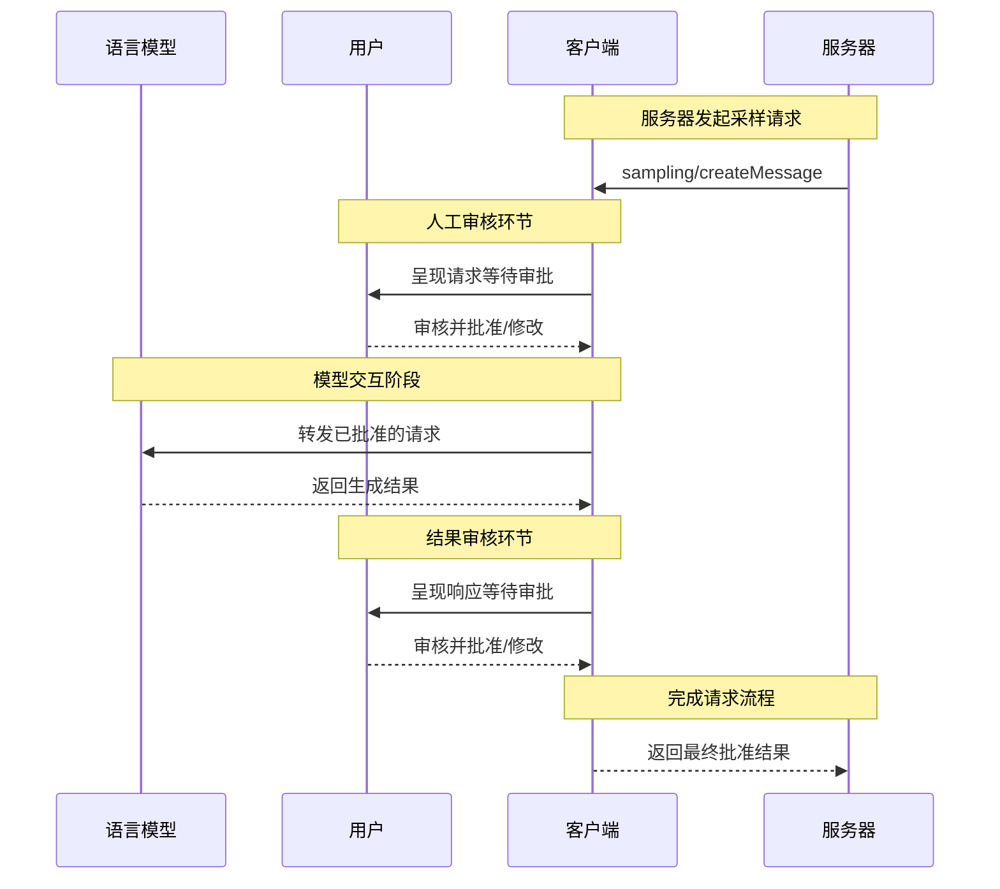
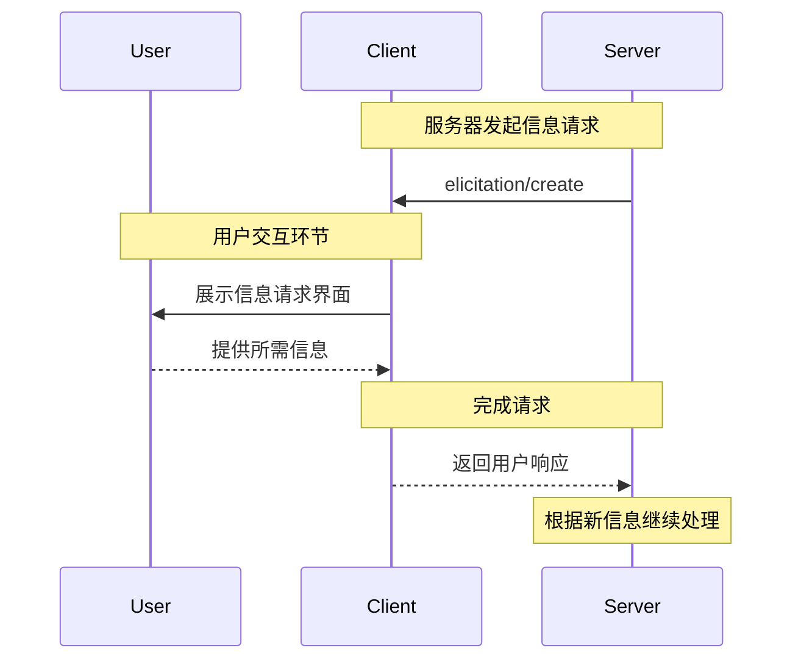

MCP客户端由宿主应用程序实例化，用于与特定MCP服务器通信。像Claude.ai或集成开发环境这样的宿主应用负责管理整体用户体验，并协调多个客户端。每个客户端独立处理与单个服务器的直接通信。

理解以下区别很重要：_宿主_是用户直接交互的应用程序，而_客户端_是实现服务器连接的协议级组件。

## 客户端核心功能

除了利用服务器提供的上下文信息外，客户端还可以为服务器提供多种功能。这些客户端特性使得服务器开发者能够构建更丰富的交互体验。例如，客户端允许MCP服务器通过询问机制向用户请求更多信息。客户端主要提供以下能力：

### 采样功能

采样功能使得服务器可以通过客户端请求语言模型补全，在保持安全性和用户控制的前提下实现智能代理行为。

#### 功能概述

采样功能让服务器能够执行依赖AI的任务，而无需直接集成或支付AI模型费用。相反，服务器可以请求已具备AI模型访问权限的客户端代为处理这些任务。这种方式使客户端完全掌控用户权限和安全措施。由于采样请求发生在其他操作（如工具分析数据）的上下文中，并作为独立模型调用处理，因此能清晰划分不同上下文，更高效地利用上下文窗口。

**采样流程示意：**



该流程通过多个人工审核节点确保安全性。用户在请求初始阶段和生成响应阶段都能进行审核和修改，然后结果才会返回服务器。

**请求参数示例：**

```typescript
{
  messages: [
    {
      role: "user",
      content: "分析这些航班选项并推荐最佳选择：\n" +
               "[47个包含价格、时间、航司和中转的航班]\n" +
               "用户偏好：早晨出发，最多1次中转"
    }
  ],
  modelPreferences: {
    hints: [{
      name: "claude-3-5-sonnet"  // 建议使用的模型
    }],
    costPriority: 0.3,      // 对API成本不太敏感
    speedPriority: 0.2,     // 可以等待详细分析
    intelligencePriority: 0.9  // 需要复杂权衡评估
  },
  systemPrompt: "你是一位旅行专家，需要根据用户偏好帮助他们选择最佳航班",
  maxTokens: 1500
}
```
#### 示例：航班分析工具

假设一个旅行预订服务器内置名为`findBestFlight`的工具，该工具通过抽样分析可用航班并推荐最优选择。当用户提出"帮我预订下个月去巴塞罗那的最佳航班"时，工具需要借助AI来评估复杂的权衡因素。

该工具会查询航空公司API并收集47个航班选项，随后请求AI协助分析："请分析这些航班选项并推荐最佳选择：[47个航班含价格、时刻、航司及中转信息] 用户偏好：早间起飞，最多1次中转。"

客户端会询问用户："允许发送抽样分析请求？"获得批准后，AI将评估各项权衡因素——例如红眼航班更便宜但早间航班更方便。工具根据分析结果向用户展示前三名推荐方案。


#### 用户交互模型

抽样功能设计以"人在回路"控制为基本原则，通过以下机制保障用户监督权：

**审批控制**：每个抽样请求都需要用户明确同意。客户端会展示服务器想要分析的内容及原因，用户可批准、拒绝或修改请求。

**透明度功能**：客户端显示具体提示词、模型选择和token限额。用户可在AI响应返回服务器前进行复核。

**配置选项**：用户可设置模型偏好、配置可信操作的自动审批，或要求所有操作都需审批。客户端可能提供敏感信息脱敏选项。用户通过`includeContext`参数决定会话上下文在抽样请求中的包含范围。

**隔离机制**：抽样请求默认与会话主上下文隔离。服务器无法获取用户对话记录。

**安全考量**：客户端和服务端在抽样过程中都需妥善处理敏感数据。客户端应实施速率限制并验证所有消息内容。"人在回路"设计确保未经用户明确同意，服务器发起的AI交互不会危及安全或访问敏感数据。


### 根目录

根目录为服务器操作定义文件系统边界，允许客户端指定服务器应关注的目录范围。


#### 概述

根目录是客户端向服务器传达文件系统访问边界的机制，由表示可操作目录的文件URI构成。这种机制帮助服务器理解可用文件和文件夹的范围，而非授予其无限制的文件系统访问权，在维持安全边界的同时引导服务器聚焦相关工作目录。

**根目录结构：**

```json
{
  "uri": "file:///Users/agent/travel-planning",
  "name": "旅行规划工作区"
}
```

根目录仅限文件系统路径，始终使用`file://`URI方案。它们帮助服务器理解项目边界、工作区组织和可访问目录。随着用户处理不同项目或文件夹，根目录列表可动态更新，服务器通过`roots/list_changed`接收边界变更通知。

需重点说明的是：根目录仅为服务器提供操作指引，客户端始终保有完整的文件访问控制权。根目录仅传达预期边界，实际文件访问始终受客户端安全策略管控。
#### 示例：旅行规划工作区

一位同时处理多个客户行程的旅行顾问，通过根目录组织文件系统访问能显著提升效率。设想一个工作区，其中包含针对旅行规划不同方面的独立目录。

客户向旅行规划服务器提供以下文件系统根目录：

- `file:///Users/agent/travel-planning` - 存放所有旅行文件的主工作区  
- `file:///Users/agent/travel-templates` - 可复用的行程模板和资源  
- `file:///Users/agent/client-documents` - 客户护照和旅行证件  

当顾问创建巴塞罗那行程时，服务器将在这些边界内工作——调用模板、保存新行程、查阅客户证件。它无法访问根目录之外的文件。服务器通常通过根目录的相对路径或遵守根目录边界约束的文件搜索工具来访问文件。

若顾问打开归档文件夹如`file:///Users/agent/archive/2023-trips`，客户端会通过`roots/list_changed`更新根目录列表。

#### 用户交互模型

根目录通常由宿主应用根据用户行为自动管理，但某些应用可能支持手动配置：

**自动根目录检测**：当用户打开文件夹时，客户端自动将其设为可访问根目录。打开旅行工作区后，服务器即可访问该目录内的行程和证件。

**手动根目录配置**：高级用户可通过配置指定根目录。例如添加`/travel-templates`存放可复用资源，同时排除含财务记录的目录。

### 动态信息获取

动态信息获取功能允许服务器在交互过程中向用户请求特定信息，从而创建更灵活的工作流。

#### 概述

该机制为服务器提供了结构化获取必要信息的方式。服务器无需预先获取全部信息，也不会因数据缺失而中断操作，而是可以暂停流程向用户请求特定输入。这种交互模式使服务能适应用户需求，而非遵循固定流程。

**动态获取流程：**



该流程实现动态信息收集。服务器在需要时请求特定数据，用户通过适配界面提供信息，服务器获取新上下文后继续处理。

**动态请求组件示例：**

```typescript
{
  method: "elicitation/requestInput",
  params: {
    message: "请确认您的巴塞罗那度假预订详情：",
    schema: {
      type: "object",
      properties: {
        confirmBooking: {
          type: "boolean",
          description: "确认预订（机票+酒店=$3000）"
        },
        seatPreference: {
          type: "string",
          enum: ["靠窗", "靠过道", "无偏好"],
          description: "航班座位偏好"
        },
        roomType: {
          type: "string",
          enum: ["海景房", "城景房", "花园景房"],
          description: "酒店房型偏好"
        },
        travelInsurance: {
          type: "boolean",
          default: false,
          description: "添加旅行保险（$150）"
        }
      },
      required: ["confirmBooking"]
    }
  }
}
```
#### 示例：假期预订确认  

一个旅行预订服务通过最终确认流程展现了信息征询的高效性。当用户选中心仪的巴塞罗那度假套餐后，服务器需在继续操作前获取最终确认并补充缺失的细节。  

服务器通过结构化请求征询预订确认，其中包含行程摘要（6月15日至22日巴塞罗那航班、海滨酒店、总计3000美元）以及可选偏好字段——例如座位选择、房型或旅行保险选项。  

随着预订流程推进，服务器会征询完成预订所需的联系方式。它可能要求填写航班预订的旅客信息、酒店特殊需求或紧急联系人信息。  

#### 用户交互模型  

信息征询交互设计遵循清晰、情境化且尊重用户自主权的原则：  

**请求呈现**：客户端展示征询请求时，需明确说明发起方、信息用途及使用方式。请求消息解释目的，而数据架构提供结构化和验证机制。  

**响应选项**：用户可通过合适的UI控件（输入框、下拉菜单、复选框）提交信息，选择拒绝提供（可附加说明），或取消整个操作。客户端会依据架构验证响应内容再返回给服务器。  

**隐私考量**：信息征询绝不索要密码或API密钥。客户端会对可疑请求发出警告，并允许用户在发送前复核数据。