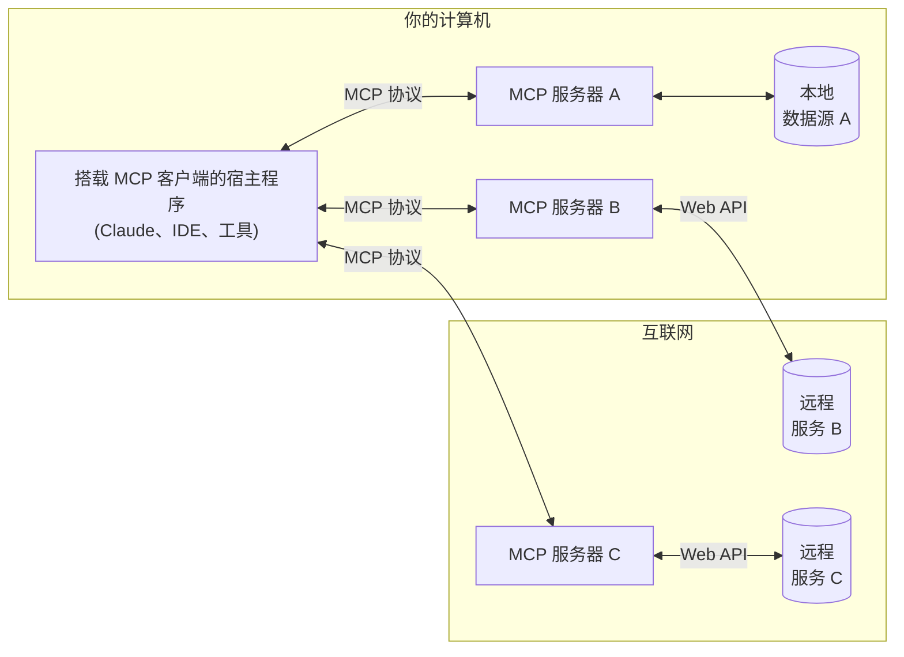

---  
title: 简介  
description: "开始使用模型上下文协议 (MCP)"  
---  

MCP 是一个开放协议，它标准化了应用程序如何向大语言模型提供上下文。你可以把 MCP 想象成 AI 应用的 USB-C 接口。就像 USB-C 为设备连接各种外设提供了统一标准，MCP 则为 AI 模型连接不同数据源和工具提供了标准化方式。  

## 为什么选择 MCP？  

MCP 能帮助你在 LLM 之上构建智能体和复杂工作流。大语言模型经常需要与数据和工具集成，而 MCP 提供了：  

- 不断增长的预建集成列表，让你的 LLM 可以直接接入  
- 在不同 LLM 供应商之间灵活切换的能力  
- 在基础设施内保护数据安全的最佳实践  

### 整体架构  

MCP 采用客户端-服务器架构，宿主应用可以连接多个服务器：  

- **MCP 宿主程序**：如 Claude 桌面版、IDE 或 AI 工具等需要通过 MCP 访问数据的程序  
- **MCP 客户端**：与服务器保持一对一连接的协议客户端  
- **MCP 服务器**：通过标准化模型上下文协议暴露特定能力的轻量级程序  
- **本地数据源**：MCP 服务器可安全访问的你计算机上的文件、数据库和服务  
- **远程服务**：可通过互联网访问的外部系统（如通过 API），MCP 服务器可与之连接  

## 快速开始  

选择最适合你需求的路径：  

### 快速入门  

<CardGroup cols={2}>  
  <Card title="服务器开发者指南" icon="bolt" href="/quickstart/server">  
    开始构建你自己的服务器，用于 Claude 桌面版和其他客户端  
  </Card>  
  <Card title="客户端开发者指南" icon="bolt" href="/quickstart/client">  
    开始构建能与所有 MCP 服务器集成的客户端  
  </Card>  
  <Card title="Claude 桌面版用户指南" icon="bolt" href="/quickstart/user">  
    开始在 Claude 桌面版中使用预构建的服务器  
  </Card>  
</CardGroup>  

### 示例  

<CardGroup cols={2}>  
  <Card title="服务器示例" icon="grid" href="/examples">  
    查看我们官方的 MCP 服务器和实现案例库  
  </Card>  
  <Card title="客户端示例" icon="cubes" href="/clients">  
    浏览支持 MCP 集成的客户端列表  
  </Card>  
</CardGroup>  

## 教程  

<CardGroup cols={2}>  
  <Card  
    title="用 LLM 构建 MCP"  
    icon="comments"  
    href="/tutorials/building-mcp-with-llms"  
  >  
    学习如何使用 Claude 等大语言模型加速 MCP 开发  
  </Card>  
  <Card title="调试指南" icon="bug" href="/legacy/tools/debugging">  
    学习如何高效调试 MCP 服务器和集成  
  </Card>  
  <Card  
    title="MCP 检查器"  
    icon="magnifying-glass"  
    href="/legacy/tools/inspector"  
  >  
    使用我们的交互式调试工具测试和检查 MCP 服务器  
  </Card>  
  <Card  
    title="MCP 研讨会（视频，2小时）"  
    icon="person-chalkboard"  
    href="https://www.youtube.com/watch?v=kQmXtrmQ5Zg"  
  >  
    <iframe src="https://www.youtube.com/embed/kQmXtrmQ5Zg"> </iframe>  
  </Card>  
</CardGroup>
## 探索MCP

深入了解MCP的核心概念与功能：

<CardGroup cols={2}>
  <Card
    title="核心架构"
    icon="sitemap"
    href="/legacy/concepts/architecture"
  >
    理解MCP如何连接客户端、服务器与大型语言模型
  </Card>
  <Card title="资源管理" icon="database" href="/legacy/concepts/resources">
    将服务器数据与内容暴露给大型语言模型使用
  </Card>
  <Card title="提示词" icon="message" href="/legacy/concepts/prompts">
    创建可复用的提示模板与工作流
  </Card>
  <Card title="工具集" icon="wrench" href="/legacy/concepts/tools">
    让大型语言模型通过您的服务器执行操作
  </Card>
  <Card title="采样" icon="robot" href="/legacy/concepts/sampling">
    允许您的服务器向大型语言模型请求补全结果
  </Card>
  <Card
    title="传输机制"
    icon="network-wired"
    href="/legacy/concepts/transports"
  >
    了解MCP的通信原理
  </Card>
</CardGroup>

## 参与贡献

想要贡献力量？查看我们的[贡献指南](/development/contributing)了解如何帮助改进MCP。

## 支持与反馈

获取帮助或提供反馈的渠道：

- 针对MCP规范、SDK或文档（开源项目）的问题报告与功能需求，请[创建GitHub工单](https://github.com/modelcontextprotocol)
- 关于MCP规范的讨论或问答，请使用[规范讨论区](https://github.com/modelcontextprotocol/specification/discussions)
- 其他MCP开源组件的讨论或问答，请使用[组织讨论区](https://github.com/orgs/modelcontextprotocol/discussions)
- 关于Claude.app和claude.ai的MCP集成问题，请参阅Anthropic的[获取支持指南](https://support.anthropic.com/en/articles/9015913-how-to-get-support)