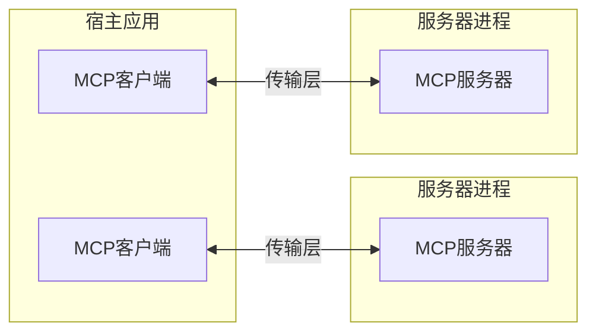
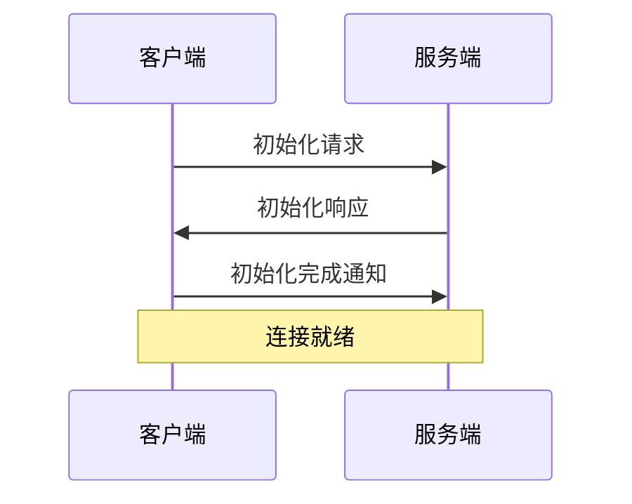

---  
title: "核心架构"  
description: "了解MCP如何连接客户端、服务器与大型语言模型"  
---  

模型上下文协议(MCP)基于灵活可扩展的架构设计，实现了LLM应用与集成服务间的无缝通信。本文档阐述其核心架构组件与设计理念。  

## 概述  

MCP采用客户端-服务器架构：  

- **宿主应用** 指发起连接的LLM应用（如Claude桌面版或集成开发环境）  
- **客户端** 在宿主应用内部与服务器保持1:1连接  
- **服务器** 为客户端提供上下文、工具及提示词  



## 核心组件  

### 协议层  

协议层负责消息封装、请求/响应关联及高层通信模式。  

<CodeGroup>  

```typescript TypeScript  
class Protocol<Request, Notification, Result> {  
  // 处理入站请求  
  setRequestHandler<T>(  
    schema: T,  
    handler: (request: T, extra: RequestHandlerExtra) => Promise<Result>,  
  ): void;  

  // 处理入站通知  
  setNotificationHandler<T>(  
    schema: T,  
    handler: (notification: T) => Promise<void>,  
  ): void;  

  // 发送请求并等待响应  
  request<T>(request: Request, schema: T, options?: RequestOptions): Promise<T>;  

  // 发送单向通知  
  notification(notification: Notification): Promise<void>;  
}  
```  

```python Python  
class Session(BaseSession[RequestT, NotificationT, ResultT]):  
    async def send_request(  
        self,  
        request: RequestT,  
        result_type: type[Result]  
    ) -> Result:  
        """发送请求并等待响应。若响应含错误则抛出McpError异常"""  

        # 请求处理实现  

    async def send_notification(  
        self,  
        notification: NotificationT  
    ) -> None:  
        """发送无需响应的单向通知"""  

        # 通知处理实现  

    async def _received_request(  
        self,  
        responder: RequestResponder[ReceiveRequestT, ResultT]  
    ) -> None:  
        """处理来自对端的入站请求"""  

        # 请求处理实现  

    async def _received_notification(  
        self,  
        notification: ReceiveNotificationT  
    ) -> None:  
        """处理来自对端的入站通知"""  

        # 通知处理实现  
```  

</CodeGroup>  

关键类包括：  

- `Protocol`  
- `Client`  
- `Server`  

### 传输层  

传输层负责客户端与服务器间的实际通信。MCP支持多种传输机制：  

1. **标准输入输出传输**  
   - 通过标准输入/输出流通信  
   - 适用于本地进程场景  

2. **可流式HTTP传输**  
   - 采用HTTP协议并可选服务器推送事件实现流式传输  
   - 使用HTTP POST传递客户端到服务器的消息  

所有传输方式均采用[JSON-RPC](https://www.jsonrpc.org/) 2.0协议交换消息。详见[协议规范](/specification/)获取模型上下文协议消息格式的详细信息。
### 消息类型

MCP协议主要包含以下几种消息类型：

1. **请求(Requests)**：需要对方响应
   ```typescript
   interface Request {
     method: string;
     params?: { ... };
   }
   ```

2. **结果(Results)**：对请求的成功响应
   ```typescript
   interface Result {
     [key: string]: unknown;
   }
   ```

3. **错误(Errors)**：表示请求处理失败
   ```typescript
   interface Error {
     code: number;
     message: string;
     data?: unknown;
   }
   ```

4. **通知(Notifications)**：单向消息，无需响应
   ```typescript
   interface Notification {
     method: string;
     params?: { ... };
   }
   ```

## 连接生命周期

### 1. 初始化阶段



1. 客户端发送携带协议版本和能力的`initialize`请求
2. 服务端返回自身的协议版本和能力
3. 客户端发送`initialized`通知作为确认
4. 开始正常消息交互

### 2. 消息交互

初始化完成后支持以下模式：
- **请求-响应模式**：客户端或服务端发送请求，另一方回应
- **通知模式**：任意一方发送单向消息

### 3. 连接终止

可通过以下方式终止连接：
- 调用`close()`进行优雅关闭
- 传输层断开连接
- 出现错误条件时

## 错误处理

MCP定义了以下标准错误码：

```typescript
enum ErrorCode {
  // JSON-RPC标准错误码
  解析错误 = -32700,
  无效请求 = -32600,
  方法不存在 = -32601,
  无效参数 = -32602,
  内部错误 = -32603,
}
```

SDK和应用可在-32000以上范围自定义错误码。错误通过以下途径传播：
- 请求的错误响应
- 传输层的错误事件
- 协议级错误处理器

## 实现示例

基础MCP服务端实现示例：

<CodeGroup>

```typescript TypeScript
import { Server } from "@modelcontextprotocol/sdk/server/index.js";
import { StdioServerTransport } from "@modelcontextprotocol/sdk/server/stdio.js";

const server = new Server(
  {
    name: "示例服务端",
    version: "1.0.0",
  },
  {
    capabilities: {
      resources: {},
    },
  },
);

// 请求处理器
server.setRequestHandler(ListResourcesRequestSchema, async () => {
  return {
    resources: [
      {
        uri: "example://resource",
        name: "示例资源",
      },
    ],
  };
});

// 连接传输层
const transport = new StdioServerTransport();
await server.connect(transport);
```

```python Python
import asyncio
import mcp.types as types
from mcp.server import Server
from mcp.server.stdio import stdio_server

app = Server("示例服务端")

@app.list_resources()
async def list_resources() -> list[types.Resource]:
    return [
        types.Resource(
            uri="example://resource",
            name="示例资源"
        )
    ]

async def main():
    async with stdio_server() as streams:
        await app.run(
            streams[0],
            streams[1],
            app.create_initialization_options()
        )

if __name__ == "__main__":
    asyncio.run(main())
```

</CodeGroup>

## 最佳实践

### 传输层选择

1. **本地通信**
   - 使用stdio传输进行本地进程通信
   - 同机通信效率高
   - 进程管理简单

2. **远程通信**
   - 需要HTTP兼容性时使用Streamable HTTP
   - 需考虑认证授权等安全因素
### 消息处理

1. **请求处理**  
   - 全面验证输入数据  
   - 使用类型安全的结构定义  
   - 优雅地处理错误  
   - 实现超时机制  

2. **进度报告**  
   - 对耗时操作使用进度令牌  
   - 增量式报告进度  
   - 已知总进度时需包含  

3. **错误管理**  
   - 使用恰当的错误代码  
   - 包含有帮助的错误信息  
   - 出错时清理资源  

## 安全考量  

1. **传输安全**  
   - 远程连接使用 TLS  
   - 验证连接来源  
   - 需要时实施身份验证  

2. **消息验证**  
   - 验证所有传入消息  
   - 输入数据净化  
   - 检查消息大小限制  
   - 校验 JSON-RPC 格式  

3. **资源保护**  
   - 实施访问控制  
   - 验证资源路径  
   - 监控资源使用情况  
   - 请求限流  

4. **错误处理**  
   - 不泄露敏感信息  
   - 记录安全相关错误  
   - 执行妥善的资源清理  
   - 处理拒绝服务场景  

## 调试与监控  

1. **日志记录**  
   - 记录协议事件  
   - 跟踪消息流转  
   - 监控性能表现  
   - 记录错误信息  

2. **诊断措施**  
   - 实现健康检查  
   - 监控连接状态  
   - 追踪资源使用  
   - 性能分析  

3. **测试**  
   - 测试不同传输方式  
   - 验证错误处理机制  
   - 检查边界情况  
   - 服务器压力测试