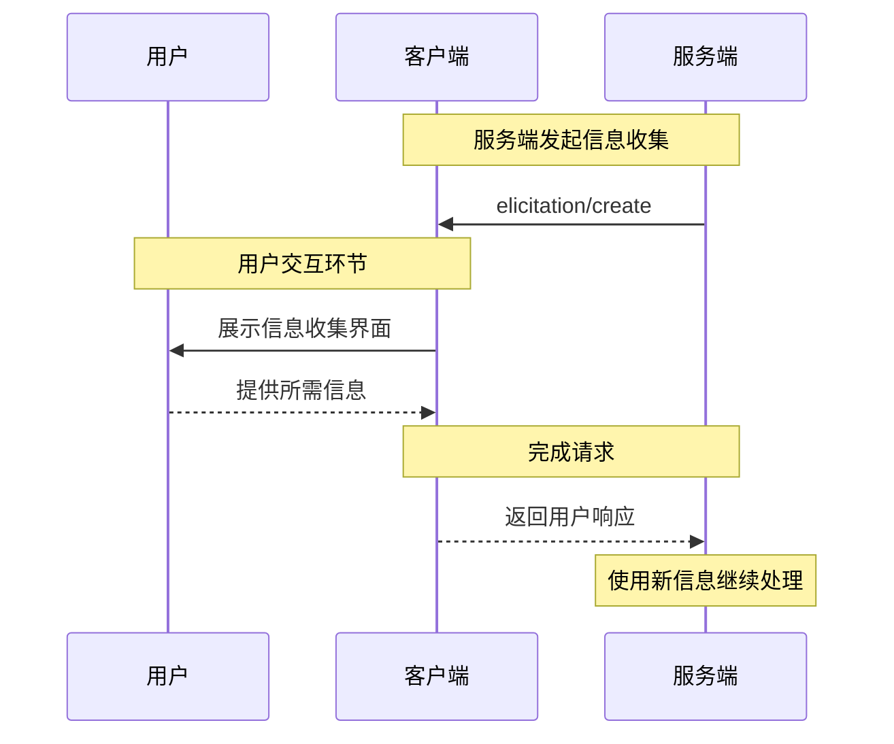

---  
title: "信息引导"  
description: "MCP中的交互式信息收集"  
---  

信息引导是MCP的一项强大功能，允许服务器在交互过程中向用户请求额外信息。这实现了动态工作流，服务器可按需获取必要数据，同时保持用户控制权和隐私。  

<Info>  
  信息引导功能首次引入于MCP规范[2025-06-18修订版](/specification/2025-06-18/client/elicitation)。  
</Info>  

## 什么是信息引导？  

信息引导为MCP服务器提供了一种标准化方式，通过客户端向用户请求结构化信息。不同于要求预先提供所有信息，服务器可以在需要时精准获取特定数据，从而创建更自然灵活的交互体验。  

例如，服务器可以：  
- 在连接服务时请求用户名  
- 在设置过程中询问配置偏好  
- 创建新资源时收集项目详情  

## 工作原理  

信息引导流程简单直观：  
1. 服务器发送包含消息和预期数据结构的引导请求  
2. 客户端通过合适界面向用户展示请求  
3. 用户选择接受、拒绝或取消请求  
4. 客户端验证并将响应返回服务器  
5. 服务器根据提供的信息继续处理  

## 请求结构  

引导请求包含两个核心部分：  

### 消息说明  
清晰易懂的文字解释，说明需要哪些信息及原因。  

### 数据模式  
采用JSON Schema定义响应数据的预期结构。该模式特意限定为包含基本类型的扁平对象，以简化客户端实现。  

示例请求：  
```json  
{  
  "message": "请提供您的GitHub用户名",  
  "requestedSchema": {  
    "type": "object",  
    "properties": {  
      "username": {  
        "type": "string",  
        "title": "GitHub用户名",  
        "description": "您的GitHub用户名（例如octocat）"  
      }  
    },  
    "required": ["username"]  
  }  
}  
```  

## 支持的数据类型  

信息引导支持以下基本类型：  

### 文本输入  
```json  
{  
  "type": "string",  
  "title": "项目名称",  
  "description": "新项目的名称",  
  "minLength": 3,  
  "maxLength": 50  
}  
```  

### 数字  
```json  
{  
  "type": "number",  
  "title": "端口号",  
  "description": "运行服务的端口号",  
  "minimum": 1024,  
  "maximum": 65535  
}  
```  

### 布尔选择  
```json  
{  
  "type": "boolean",  
  "title": "启用分析",  
  "description": "发送匿名使用统计",  
  "default": false  
}  
```  

### 选择列表  
```json  
{  
  "type": "string",  
  "title": "环境",  
  "enum": ["development", "staging", "production"],  
  "enumNames": ["开发环境", "预发布环境", "生产环境"]  
}  
```  

## 用户响应操作  

用户可通过三种方式响应引导请求：  
1. **接受**：提供请求的信息  
2. **拒绝**：明确拒绝提供信息  
3. **取消**：不做选择直接关闭（如关闭对话框）  

服务器应妥善处理每种响应：  
- 接受 → 处理提供的数据  
- 拒绝 → 提供备选方案或调整工作流  
- 取消 → 考虑稍后重试或使用默认值  

## 最佳实践  

实施信息引导时建议：  

### 服务器侧  
1. **表述清晰**：详细说明信息需求的原因  
2. **最小化请求**：仅索取必要信息  
3. **保持灵活**：为拒绝/取消情况准备备用方案  
4. **把握时机**：在真正需要时发起请求  
5. **尊重隐私**：绝不索取密码或令牌等敏感信息
### 面向客户端  

1. **保持透明**：明确显示请求信息的服务器身份  
2. **注重保护**：允许用户查看并修改返回内容  
3. **实施验证**：根据提供的模式校验响应数据  
4. **赋予权限**：突出显示拒绝和取消选项  
5. **合理限制**：实施速率限制防止滥用  

## 常见使用场景  

该方案特别适用于以下场景：  

- **初始化配置**：首次设置时收集配置信息  
- **动态工作流**：请求上下文相关的特定信息  
- **用户偏好**：收集可选设置和个性化选项  
- **项目详情**：获取待创建资源的元数据  
- **服务集成**：请求外部服务的用户名或ID  

## 示例流程  

典型的交互流程如下：  



## 安全注意事项  

<Warning>  
  服务端绝对不得通过此方式索取密码、API密钥、令牌等敏感凭证，应使用标准认证流程。  
</Warning>  

核心安全准则：  

1. 服务端仅应请求非敏感信息  
2. 客户端需明确标识请求方的服务器身份  
3. 必须始终为用户提供拒绝选项  
4. 响应数据需根据模式进行验证  
5. 通过速率限制防止请求泛滥  

## 实现示例  

以下是服务端收集项目信息的实现范例：  

```typescript  
// 服务端请求项目详情  
const response = await client.request("elicitation/create", {  
  message: "开始配置您的新项目",  
  requestedSchema: {  
    type: "object",  
    properties: {  
      name: {  
        type: "string",  
        title: "项目名称",  
        description: "为项目设置描述性名称",  
      },  
      framework: {  
        type: "string",  
        title: "框架选择",  
        enum: ["react", "vue", "angular", "none"],  
        enumNames: ["React", "Vue", "Angular", "无"],  
      },  
      useTypeScript: {  
        type: "boolean",  
        title: "使用TypeScript",  
        default: true,  
      },  
    },  
    required: ["name", "framework"],  
  },  
});  

// 处理响应  
if (response.action === "accept") {  
  // 使用提供的信息创建项目  
  await createProject(response.content);  
} else if (response.action === "decline") {  
  // 使用默认配置或提供替代方案  
  await createDefaultProject();  
} else {  
  // 用户取消操作  
  console.log("项目创建已取消");  
}  
```  

该方案在尊重用户控制权和隐私的前提下，创造了流畅的交互体验。