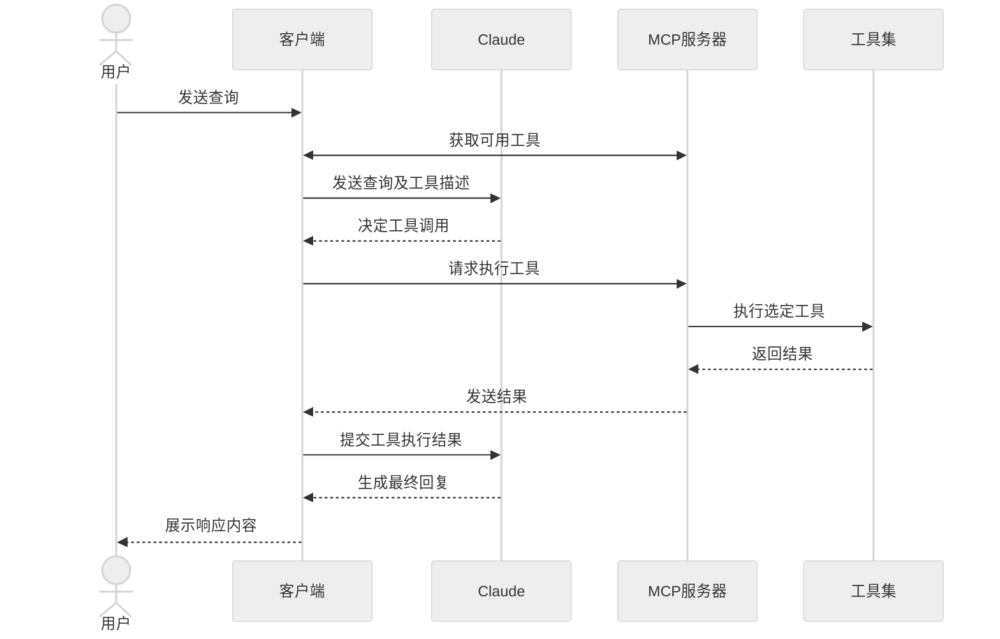

---  
标题: "构建MCP客户端"  
描述: "开始构建你自己的客户端，可与所有MCP服务器集成。"  

在本教程中，你将学习如何构建一个基于LLM的聊天机器人客户端，用于连接MCP服务器。建议先完成[服务器快速入门](/quickstart/server)，了解构建首个服务器的基础知识。  

<Tabs>  
<Tab title="Python">  

[本教程完整代码可在此处获取。](https://github.com/modelcontextprotocol/quickstart-resources/tree/main/mcp-client-python)  

## 系统要求  

开始前请确保系统满足以下条件：  
- Mac或Windows电脑  
- 已安装最新版Python  
- 已安装最新版`uv`  

## 环境配置  

首先用`uv`创建新Python项目：  
```bash  
# 创建项目目录  
uv init mcp-client  
cd mcp-client  

# 创建虚拟环境  
uv venv  

# 激活虚拟环境  
# Windows系统：  
.venv\Scripts\activate  
# Unix/macOS系统：  
source .venv/bin/activate  

# 安装依赖包  
uv add mcp anthropic python-dotenv  

# 删除模板文件  
# Windows系统：  
del main.py  
# Unix/macOS系统：  
rm main.py  

# 创建主文件  
touch client.py  
```  

## 配置API密钥  

需从[Anthropic控制台](https://console.anthropic.com/settings/keys)获取API密钥。  

创建`.env`文件存储密钥：  
```bash  
# 创建.env文件  
touch .env  
```  

将密钥添加到`.env`文件：  
```bash  
ANTHROPIC_API_KEY=<你的密钥>  
```  

将`.env`加入`.gitignore`：  
```bash  
echo ".env" >> .gitignore  
```  

<Warning>  
请妥善保管你的`ANTHROPIC_API_KEY`！  
</Warning>  

## 创建客户端  

### 基础客户端结构  

首先设置导入项并创建基础客户端类：  
```python  
import asyncio  
from typing import Optional  
from contextlib import AsyncExitStack  

from mcp import ClientSession, StdioServerParameters  
from mcp.client.stdio import stdio_client  

from anthropic import Anthropic  
from dotenv import load_dotenv  

load_dotenv()  # 从.env加载环境变量  

class MCPClient:  
    def __init__(self):  
        # 初始化会话和客户端对象  
        self.session: Optional[ClientSession] = None  
        self.exit_stack = AsyncExitStack()  
        self.anthropic = Anthropic()  

    # 方法将在此添加  
```  

### 服务器连接管理  

接下来实现连接MCP服务器的方法：  
```python  
async def connect_to_server(self, server_script_path: str):  
    """连接MCP服务器  

    参数:  
        server_script_path: 服务器脚本路径(.py或.js文件)  
    """  
    is_python = server_script_path.endswith('.py')  
    is_js = server_script_path.endswith('.js')  
    if not (is_python or is_js):  
        raise ValueError("服务器脚本必须是.py或.js文件")  

    command = "python" if is_python else "node"  
    server_params = StdioServerParameters(  
        command=command,  
        args=[server_script_path],  
        env=None  
    )  

    stdio_transport = await self.exit_stack.enter_async_context(stdio_client(server_params))  
    self.stdio, self.write = stdio_transport  
    self.session = await self.exit_stack.enter_async_context(ClientSession(self.stdio, self.write))  

    await self.session.initialize()  

    # 列出可用工具  
    response = await self.session.list_tools()  
    tools = response.tools  
    print("\n已连接服务器，可用工具:", [tool.name for tool in tools])  
```
### 查询处理逻辑

现在让我们添加处理查询和工具调用的核心功能：

```python
async def process_query(self, query: str) -> str:
    """使用Claude和可用工具处理查询"""
    messages = [
        {
            "role": "user",
            "content": query
        }
    ]

    response = await self.session.list_tools()
    available_tools = [{
        "name": tool.name,
        "description": tool.description,
        "input_schema": tool.inputSchema
    } for tool in response.tools]


    # 初始Claude API调用
    response = self.anthropic.messages.create(
        model="claude-3-5-sonnet-20241022",
        max_tokens=1000,
        messages=messages,
        tools=available_tools
    )


    # 处理响应并执行工具调用
    final_text = []

    assistant_message_content = []
    for content in response.content:
        if content.type == 'text':
            final_text.append(content.text)
            assistant_message_content.append(content)
        elif content.type == 'tool_use':
            tool_name = content.name
            tool_args = content.input


            # 执行工具调用
            result = await self.session.call_tool(tool_name, tool_args)
            final_text.append(f"[调用工具 {tool_name} 参数 {tool_args}]")

            assistant_message_content.append(content)
            messages.append({
                "role": "assistant",
                "content": assistant_message_content
            })
            messages.append({
                "role": "user",
                "content": [
                    {
                        "type": "tool_result",
                        "tool_use_id": content.id,
                        "content": result.content
                    }
                ]
            })


            # 获取Claude的后续响应
            response = self.anthropic.messages.create(
                model="claude-3-5-sonnet-20241022",
                max_tokens=1000,
                messages=messages,
                tools=available_tools
            )

            final_text.append(response.content[0].text)

    return "\n".join(final_text)
```

### 交互式聊天界面

现在我们将添加聊天循环和清理功能：

```python
async def chat_loop(self):
    """运行交互式聊天循环"""
    print("\nMCP客户端已启动！")
    print("输入查询内容或输入'quit'退出")

    while True:
        try:
            query = input("\n查询: ").strip()

            if query.lower() == 'quit':
                break

            response = await self.process_query(query)
            print("\n" + response)

        except Exception as e:
            print(f"\n错误: {str(e)}")

async def cleanup(self):
    """清理资源"""
    await self.exit_stack.aclose()
```

### 主入口点

最后添加主执行逻辑：

```python
async def main():
    if len(sys.argv) < 2:
        print("用法: python client.py <服务器脚本路径>")
        sys.exit(1)

    client = MCPClient()
    try:
        await client.connect_to_server(sys.argv[1])
        await client.chat_loop()
    finally:
        await client.cleanup()

if __name__ == "__main__":
    import sys
    asyncio.run(main())
```

完整版`client.py`文件可在此处查看：[链接](https://gist.github.com/zckly/f3f28ea731e096e53b39b47bf0a2d4b1)

## 核心组件说明

### 1. 客户端初始化

- `MCPClient`类初始化会话管理和API客户端
- 使用`AsyncExitStack`进行资源管理
- 配置Anthropic客户端用于与Claude交互

### 2. 服务器连接

- 支持Python和Node.js服务器
- 验证服务器脚本类型
- 建立通信通道
- 初始化会话并列出可用工具
### 3. 查询处理模块

- 维护对话上下文
- 处理Claude的响应与工具调用
- 管理Claude与工具间的消息流转
- 将结果整合为连贯响应

### 4. 交互界面模块

- 提供简洁命令行界面
- 处理用户输入并展示响应
- 包含基础错误处理机制
- 支持优雅退出功能

### 5. 资源管理模块

- 实现资源规范清理
- 处理连接异常情况
- 执行优雅停机流程

## 常见定制化节点

1. **工具处理**
   - 修改`process_query()`以适配特定工具类型
   - 添加工具调用的自定义错误处理
   - 实现工具专属的响应格式化

2. **响应处理**
   - 自定义工具结果呈现格式
   - 增加响应过滤或转换功能
   - 实现定制化日志记录

3. **用户界面**
   - 添加GUI或网页界面
   - 实现富文本控制台输出
   - 增加命令历史或自动补全

## 运行客户端

连接任意MCP服务器的启动命令：

```bash
uv run client.py path/to/server.py # python服务端
uv run client.py path/to/build/index.js # node服务端
```

<Note>

若延续天气服务端快速入门教程，您的命令可能类似：`python client.py .../quickstart-resources/weather-server-python/weather.py`

</Note>

客户端将执行以下流程：

1. 连接指定服务器
2. 列出可用工具
3. 启动交互式会话，支持：
   - 输入查询
   - 查看工具执行
   - 获取Claude响应

以下是连接天气服务端时的预期界面示例：

<Frame>
  
</Frame>

## 工作原理

提交查询时的处理流程：

1. 客户端从服务器获取可用工具列表
2. 查询与工具描述同步发送至Claude
3. Claude决策是否调用工具
4. 客户端通过服务器执行工具调用
5. 结果回传至Claude
6. Claude生成自然语言响应
7. 向用户展示最终响应

## 最佳实践

1. **错误处理**
   - 工具调用必须包含try-catch块
   - 提供有意义的错误提示
   - 优雅处理连接问题

2. **资源管理**
   - 使用`AsyncExitStack`确保资源清理
   - 及时关闭连接
   - 处理服务端断开情况

3. **安全性**
   - API密钥应存储在`.env`中
   - 验证服务端响应
   - 谨慎设置工具权限

## 故障排查

### 服务端路径问题

- 确认服务端脚本路径准确
- 相对路径无效时改用绝对路径
- Windows用户注意使用正斜杠(/)或转义反斜杠(\\)
- 验证服务端文件扩展名正确（.py对应Python，.js对应Node.js）

路径使用示例：
```bash
# 相对路径
uv run client.py ./server/weather.py

# 绝对路径
uv run client.py /Users/username/projects/mcp-server/weather.py

# Windows路径（两种格式均可）
uv run client.py C:/projects/mcp-server/weather.py
uv run client.py C:\\projects\\mcp-server\\weather.py
```

### 响应延迟

- 首次响应可能需30秒
- 以下情况属正常现象：
  - 服务端初始化
  - Claude处理查询
  - 工具执行中
- 后续响应通常更快
- 初始等待期间请勿中断进程
### 常见错误信息

如果遇到以下错误：

- `FileNotFoundError`：请检查服务器路径
- `连接被拒绝`：确保服务器正在运行且路径正确
- `工具执行失败`：验证工具所需的环境变量是否已设置
- `超时错误`：考虑增加客户端配置中的超时时间

</Tab>

<Tab title="Node">

[本教程完整代码可在此处获取](https://github.com/modelcontextprotocol/quickstart-resources/tree/main/mcp-client-typescript)

## 系统要求

开始前请确保系统满足以下要求：

- Mac 或 Windows 电脑
- 已安装 Node.js 17 或更高版本
- 已安装最新版 `npm`
- 拥有 Anthropic API 密钥（Claude）

## 环境设置

首先创建并设置项目：

<CodeGroup>

```bash macOS/Linux
# 创建项目目录
mkdir mcp-client-typescript
cd mcp-client-typescript

# 初始化 npm 项目
npm init -y

# 安装依赖
npm install @anthropic-ai/sdk @modelcontextprotocol/sdk dotenv

# 安装开发依赖
npm install -D @types/node typescript

# 创建源文件
touch index.ts
```

```powershell Windows
# 创建项目目录
md mcp-client-typescript
cd mcp-client-typescript

# 初始化 npm 项目
npm init -y

# 安装依赖
npm install @anthropic-ai/sdk @modelcontextprotocol/sdk dotenv

# 安装开发依赖
npm install -D @types/node typescript

# 创建源文件
new-item index.ts
```

</CodeGroup>

更新 `package.json` 设置 `type: "module"` 并添加构建脚本：

```json package.json
{
  "type": "module",
  "scripts": {
    "build": "tsc && chmod 755 build/index.js"
  }
}
```

在项目根目录创建 `tsconfig.json`：

```json tsconfig.json
{
  "compilerOptions": {
    "target": "ES2022",
    "module": "Node16",
    "moduleResolution": "Node16",
    "outDir": "./build",
    "rootDir": "./",
    "strict": true,
    "esModuleInterop": true,
    "skipLibCheck": true,
    "forceConsistentCasingInFileNames": true
  },
  "include": ["index.ts"],
  "exclude": ["node_modules"]
}
```

## 设置 API 密钥

需要从 [Anthropic 控制台](https://console.anthropic.com/settings/keys) 获取 API 密钥。

创建 `.env` 文件存储密钥：

```bash
echo "ANTHROPIC_API_KEY=<your key here>" > .env
```

将 `.env` 添加到 `.gitignore`：

```bash
echo ".env" >> .gitignore
```

<Warning>

请妥善保管您的 `ANTHROPIC_API_KEY`！

</Warning>

## 创建客户端

### 基础客户端结构

首先在 `index.ts` 中设置导入并创建基础客户端类：

```typescript
import { Anthropic } from "@anthropic-ai/sdk";
import {
  MessageParam,
  Tool,
} from "@anthropic-ai/sdk/resources/messages/messages.mjs";
import { Client } from "@modelcontextprotocol/sdk/client/index.js";
import { StdioClientTransport } from "@modelcontextprotocol/sdk/client/stdio.js";
import readline from "readline/promises";
import dotenv from "dotenv";

dotenv.config();

const ANTHROPIC_API_KEY = process.env.ANTHROPIC_API_KEY;
if (!ANTHROPIC_API_KEY) {
  throw new Error("未设置 ANTHROPIC_API_KEY");
}

class MCPClient {
  private mcp: Client;
  private anthropic: Anthropic;
  private transport: StdioClientTransport | null = null;
  private tools: Tool[] = [];

  constructor() {
    this.anthropic = new Anthropic({
      apiKey: ANTHROPIC_API_KEY,
    });
    this.mcp = new Client({ name: "mcp-client-cli", version: "1.0.0" });
  }
  // 方法将在此处添加
}
```
### 服务器连接管理

接下来我们将实现连接MCP服务器的方法：

```typescript
async connectToServer(serverScriptPath: string) {
  try {
    const isJs = serverScriptPath.endsWith(".js");
    const isPy = serverScriptPath.endsWith(".py");
    if (!isJs && !isPy) {
      throw new Error("服务器脚本必须是.js或.py文件");
    }
    const command = isPy
      ? process.platform === "win32"
        ? "python"
        : "python3"
      : process.execPath;

    this.transport = new StdioClientTransport({
      command,
      args: [serverScriptPath],
    });
    await this.mcp.connect(this.transport);

    const toolsResult = await this.mcp.listTools();
    this.tools = toolsResult.tools.map((tool) => {
      return {
        name: tool.name,
        description: tool.description,
        input_schema: tool.inputSchema,
      };
    });
    console.log(
      "已连接服务器，可用工具：",
      this.tools.map(({ name }) => name)
    );
  } catch (e) {
    console.log("连接MCP服务器失败：", e);
    throw e;
  }
}
```

### 查询处理逻辑

现在添加处理查询和调用工具的核心功能：

```typescript
async processQuery(query: string) {
  const messages: MessageParam[] = [
    {
      role: "user",
      content: query,
    },
  ];

  const response = await this.anthropic.messages.create({
    model: "claude-3-5-sonnet-20241022",
    max_tokens: 1000,
    messages,
    tools: this.tools,
  });

  const finalText = [];

  for (const content of response.content) {
    if (content.type === "text") {
      finalText.push(content.text);
    } else if (content.type === "tool_use") {
      const toolName = content.name;
      const toolArgs = content.input as { [x: string]: unknown } | undefined;

      const result = await this.mcp.callTool({
        name: toolName,
        arguments: toolArgs,
      });
      finalText.push(
        `[正在调用工具 ${toolName}，参数为 ${JSON.stringify(toolArgs)}]`
      );

      messages.push({
        role: "user",
        content: result.content as string,
      });

      const response = await this.anthropic.messages.create({
        model: "claude-3-5-sonnet-20241022",
        max_tokens: 1000,
        messages,
      });

      finalText.push(
        response.content[0].type === "text" ? response.content[0].text : ""
      );
    }
  }

  return finalText.join("\n");
}
```

### 交互式聊天界面

现在添加聊天循环和清理功能：

```typescript
async chatLoop() {
  const rl = readline.createInterface({
    input: process.stdin,
    output: process.stdout,
  });

  try {
    console.log("\nMCP客户端已启动！");
    console.log("输入查询内容或输入'quit'退出。");

    while (true) {
      const message = await rl.question("\n查询：");
      if (message.toLowerCase() === "quit") {
        break;
      }
      const response = await this.processQuery(message);
      console.log("\n" + response);
    }
  } finally {
    rl.close();
  }
}

async cleanup() {
  await this.mcp.close();
}
```

### 主入口点

最后添加主执行逻辑：

```typescript
async function main() {
  if (process.argv.length < 3) {
    console.log("用法：node index.ts <服务器脚本路径>");
    return;
  }
  const mcpClient = new MCPClient();
  try {
    await mcpClient.connectToServer(process.argv[2]);
    await mcpClient.chatLoop();
  } finally {
    await mcpClient.cleanup();
    process.exit(0);
  }
}

main();
```

## 运行客户端

要使用任意MCP服务器运行客户端：

```bash
# 构建TypeScript
npm run build
```
# 运行客户端  
node build/index.js path/to/server.py # Python 服务器  
node build/index.js path/to/build/index.js # Node 服务器  

```  

<Note>  

如果你正在继续天气教程（基于服务器快速入门），你的命令可能类似于：`node build/index.js .../quickstart-resources/weather-server-typescript/build/index.js`  

</Note>  

**客户端将执行以下操作：**  

1. 连接到指定服务器  
2. 列出可用工具  
3. 启动交互式聊天会话，你可以：  
   - 输入查询  
   - 查看工具执行过程  
   - 获取 Claude 的响应  

## 工作原理  

当你提交查询时：  

1. 客户端从服务器获取可用工具列表  
2. 你的查询会连同工具描述一起发送给 Claude  
3. Claude 决定使用哪些工具（如果需要）  
4. 客户端通过服务器执行请求的工具调用  
5. 结果返回给 Claude  
6. Claude 生成自然语言响应  
7. 响应内容显示给你  

## 最佳实践  

1. **错误处理**  
   - 利用 TypeScript 类型系统提高错误检测能力  
   - 用 try-catch 块包裹工具调用  
   - 提供有意义的错误信息  
   - 优雅处理连接问题  

2. **安全性**  
   - 将 API 密钥安全存储在 `.env` 文件中  
   - 验证服务器响应  
   - 谨慎管理工具权限  

## 故障排除  

### 服务器路径问题  

- 仔细检查服务器脚本路径是否正确  
- 如果相对路径无效，请使用绝对路径  
- Windows 用户需使用正斜杠(/)或转义反斜杠(\\)  
- 确认服务器文件扩展名正确（Node.js 用 .js，Python 用 .py）  

正确路径使用示例：  

```bash  
# 相对路径  
node build/index.js ./server/build/index.js  

# 绝对路径  
node build/index.js /Users/用户名/projects/mcp-server/build/index.js  

# Windows 路径（两种格式均可）  
node build/index.js C:/projects/mcp-server/build/index.js  
node build/index.js C:\\projects\\mcp-server\\build\\index.js  
```  

### 响应时间  

- 首次响应可能需要长达 30 秒  
- 这属于正常现象，发生在以下过程中：  
  - 服务器初始化  
  - Claude 处理查询  
  - 工具执行阶段  
- 后续响应通常更快  
- 初始等待期间请勿中断进程  

### 常见错误信息  

如果遇到：  

- `Error: Cannot find module`：检查构建文件夹并确认 TypeScript 编译成功  
- `Connection refused`：确保服务器正在运行且路径正确  
- `Tool execution failed`：验证工具所需环境变量是否设置  
- `ANTHROPIC_API_KEY is not set`：检查 .env 文件和环境变量  
- `TypeError`：确认工具参数类型使用正确  

</Tab>  

<Tab title="Java">  

<Note>  

这是基于 Spring AI MCP 自动配置和启动器的快速入门演示。  
要学习如何手动创建同步/异步 MCP 客户端，请参考 [Java SDK 客户端](/sdk/java/mcp-client) 文档  

</Note>  

本示例演示如何构建结合 Spring AI 模型上下文协议 (MCP) 与 [Brave 搜索 MCP 服务器](https://github.com/modelcontextprotocol/servers-archived/tree/main/src/brave-search)的交互式聊天机器人。该应用创建了一个由 Anthropic 的 Claude AI 模型驱动的对话界面，能够通过 Brave 搜索执行互联网搜索，实现与实时网络数据的自然语言交互。  
[完整教程代码可在此处获取。](https://github.com/spring-projects/spring-ai-examples/tree/main/model-context-protocol/web-search/brave-chatbot)  

## 系统要求  

开始前请确保满足以下条件：  

- Java 17 或更高版本  
- Maven 3.6+  
- npx 包管理器  
- Anthropic API 密钥（Claude）  
- Brave 搜索 API 密钥
## 环境配置指南

1. 安装npx（Node包执行工具）：
   首先确保已安装[npm](https://docs.npmjs.com/downloading-and-installing-node-js-and-npm)，
   然后运行：

   ```bash
   npm install -g npx
   ```

2. 克隆代码仓库：

   ```bash
   git clone https://github.com/spring-projects/spring-ai-examples.git
   cd model-context-protocol/brave-chatbot
   ```

3. 配置API密钥：

   ```bash
   export ANTHROPIC_API_KEY='你的anthropic-api密钥'
   export BRAVE_API_KEY='你的brave-api密钥'
   ```

4. 构建应用程序：

   ```bash
   ./mvnw clean install
   ```

5. 使用Maven运行应用：
   ```bash
   ./mvnw spring-boot:run
   ```

<Warning>

请妥善保管你的`ANTHROPIC_API_KEY`和`BRAVE_API_KEY`密钥！

</Warning>

## 实现原理

本应用通过多个组件将Spring AI与Brave搜索MCP服务器进行集成：

### MCP客户端配置

1. pom.xml所需依赖：

```xml
<dependency>
    <groupId>org.springframework.ai</groupId>
    <artifactId>spring-ai-starter-mcp-client</artifactId>
</dependency>
<dependency>
    <groupId>org.springframework.ai</groupId>
    <artifactId>spring-ai-starter-model-anthropic</artifactId>
</dependency>
```

2. 应用配置（application.yml）：

```yml
spring:
  ai:
    mcp:
      client:
        enabled: true
        name: brave-search-client
        version: 1.0.0
        type: SYNC
        request-timeout: 20s
        stdio:
          root-change-notification: true
          servers-configuration: classpath:/mcp-servers-config.json
        toolcallback:
          enabled: true
    anthropic:
      api-key: ${ANTHROPIC_API_KEY}
```

此配置会激活`spring-ai-starter-mcp-client`，根据提供的服务器配置创建一个或多个`McpClient`实例。
`spring.ai.mcp.client.toolcallback.enabled=true`属性启用了工具回调机制，自动将所有MCP工具注册为Spring AI工具（默认禁用）。

3. MCP服务器配置（`mcp-servers-config.json`）：

```json
{
  "mcpServers": {
    "brave-search": {
      "command": "npx",
      "args": ["-y", "@modelcontextprotocol/server-brave-search"],
      "env": {
        "BRAVE_API_KEY": "<输入你的BRAVE_API_KEY>"
      }
    }
  }
}
```

### 聊天功能实现

聊天机器人使用Spring AI的ChatClient结合MCP工具实现：

```java
var chatClient = chatClientBuilder
    .defaultSystem("你是一个专业的AI助手，精通人工智能和Java技术")
    .defaultToolCallbacks((Object[]) mcpToolAdapter.toolCallbacks())
    .defaultAdvisors(new MessageChatMemoryAdvisor(new InMemoryChatMemory()))
    .build();
```

<Warning>

重要变更：从SpringAI 1.0.0-M8版本开始，注册MCP工具需使用`.defaultToolCallbacks(...)`而非`.defaultTool(...)`。

</Warning>

核心特性：
- 采用Claude AI模型实现自然语言理解
- 通过MCP集成Brave搜索实现实时网络检索
- 使用InMemoryChatMemory维护对话记忆
- 作为交互式命令行应用运行

### 构建与运行

```bash
./mvnw clean install
java -jar ./target/ai-mcp-brave-chatbot-0.0.1-SNAPSHOT.jar
```

或

```bash
./mvnw spring-boot:run
```

应用启动后将进入交互式对话界面。当需要从互联网获取信息时，聊天机器人会自动使用Brave搜索功能。

功能特点：
- 基于内置知识库回答问题
- 通过Brave搜索进行网络检索
- 记忆对话上下文
- 综合多源信息提供完整解答
### 高级配置

MCP客户端支持以下额外配置选项：

- 通过`McpSyncClientCustomizer`或`McpAsyncClientCustomizer`进行客户端定制
- 支持多种传输类型的多客户端：`STDIO`和`SSE`（服务器推送事件）
- 与Spring AI工具执行框架集成
- 自动客户端初始化与生命周期管理

对于基于WebFlux的应用，可以使用WebFlux启动器替代：

```xml
<dependency>
    <groupId>org.springframework.ai</groupId>
    <artifactId>spring-ai-mcp-client-webflux-spring-boot-starter</artifactId>
</dependency>
```

该启动器提供相似功能，但采用基于WebFlux的SSE传输实现，推荐用于生产环境。

</Tab>

<Tab title="Kotlin">

[完整教程代码可在此处获取](https://github.com/modelcontextprotocol/kotlin-sdk/tree/main/samples/kotlin-mcp-client)

## 系统要求

开始前请确保系统满足以下要求：

- Java 17或更高版本
- Anthropic API密钥（Claude）

## 环境设置

首先安装`java`和`gradle`（如未安装）。  
可从[Oracle官方JDK网站](https://www.oracle.com/java/technologies/downloads/)下载Java。  
验证Java安装：

```bash
java --version
```

接下来创建并设置项目：

<CodeGroup>

```bash macOS/Linux
# 创建项目目录
mkdir kotlin-mcp-client
cd kotlin-mcp-client

# 初始化Kotlin项目
gradle init
```

```powershell Windows
# 创建项目目录
md kotlin-mcp-client
cd kotlin-mcp-client

# 初始化Kotlin项目
gradle init
```

</CodeGroup>

运行`gradle init`后，需选择项目配置：  
选择**Application**作为项目类型，**Kotlin**作为编程语言，**Java 17**作为Java版本。

也可通过[IntelliJ IDEA项目向导](https://kotlinlang.org/docs/jvm-get-started.html)创建Kotlin应用。

创建项目后添加以下依赖：

<CodeGroup>

```kotlin build.gradle.kts
val mcpVersion = "0.4.0"
val slf4jVersion = "2.0.9"
val anthropicVersion = "0.8.0"

dependencies {
    implementation("io.modelcontextprotocol:kotlin-sdk:$mcpVersion")
    implementation("org.slf4j:slf4j-nop:$slf4jVersion")
    implementation("com.anthropic:anthropic-java:$anthropicVersion")
}
```

```groovy build.gradle
def mcpVersion = '0.3.0'
def slf4jVersion = '2.0.9'
def anthropicVersion = '0.8.0'
dependencies {
    implementation "io.modelcontextprotocol:kotlin-sdk:$mcpVersion"
    implementation "org.slf4j:slf4j-nop:$slf4jVersion"
    implementation "com.anthropic:anthropic-java:$anthropicVersion"
}
```

</CodeGroup>

同时在构建脚本中添加以下插件：

<CodeGroup>

```kotlin build.gradle.kts
plugins {
    id("com.github.johnrengelman.shadow") version "8.1.1"
}
```

```groovy build.gradle
plugins {
    id 'com.github.johnrengelman.shadow' version '8.1.1'
}
```

</CodeGroup>

## API密钥设置

需要从[Anthropic控制台](https://console.anthropic.com/settings/keys)获取API密钥。

设置API密钥：

```bash
export ANTHROPIC_API_KEY='你的anthropic-api密钥'
```

<Warning>

请妥善保管`ANTHROPIC_API_KEY`！

</Warning>

## 创建客户端

### 基础客户端结构

首先创建基础客户端类：

```kotlin
class MCPClient : AutoCloseable {
    private val anthropic = AnthropicOkHttpClient.fromEnv()
    private val mcp: Client = Client(clientInfo = Implementation(name = "mcp-client-cli", version = "1.0.0"))
    private lateinit var tools: List<ToolUnion>

    // 方法将在此处实现

    override fun close() {
        runBlocking {
            mcp.close()
            anthropic.close()
        }
    }
```
### 服务器连接管理

接下来我们将实现连接MCP服务器的方法：

```kotlin
suspend fun connectToServer(serverScriptPath: String) {
    try {
        val command = buildList {
            when (serverScriptPath.substringAfterLast(".")) {
                "js" -> add("node")
                "py" -> add(if (System.getProperty("os.name").lowercase().contains("win")) "python" else "python3")
                "jar" -> addAll(listOf("java", "-jar"))
                else -> throw IllegalArgumentException("服务器脚本必须是.js、.py或.jar文件")
            }
            add(serverScriptPath)
        }

        val process = ProcessBuilder(command).start()
        val transport = StdioClientTransport(
            input = process.inputStream.asSource().buffered(),
            output = process.outputStream.asSink().buffered()
        )

        mcp.connect(transport)

        val toolsResult = mcp.listTools()
        tools = toolsResult?.tools?.map { tool ->
            ToolUnion.ofTool(
                Tool.builder()
                    .name(tool.name)
                    .description(tool.description ?: "")
                    .inputSchema(
                        Tool.InputSchema.builder()
                            .type(JsonValue.from(tool.inputSchema.type))
                            .properties(tool.inputSchema.properties.toJsonValue())
                            .putAdditionalProperty("required", JsonValue.from(tool.inputSchema.required))
                            .build()
                    )
                    .build()
            )
        } ?: emptyList()
        println("已连接到服务器，可用工具: ${tools.joinToString(", ") { it.tool().get().name() }}")
    } catch (e: Exception) {
        println("连接MCP服务器失败: $e")
        throw e
    }
}
```

同时创建一个辅助函数用于将`JsonObject`转换为Anthropic所需的`JsonValue`：

```kotlin
private fun JsonObject.toJsonValue(): JsonValue {
    val mapper = ObjectMapper()
    val node = mapper.readTree(this.toString())
    return JsonValue.fromJsonNode(node)
}
```
### 查询处理逻辑

现在添加处理查询和工具调用的核心功能：

```kotlin
private val messageParamsBuilder: MessageCreateParams.Builder = MessageCreateParams.builder()
    .model(Model.CLAUDE_3_5_SONNET_20241022)
    .maxTokens(1024)

suspend fun processQuery(query: String): String {
    val messages = mutableListOf(
        MessageParam.builder()
            .role(MessageParam.Role.USER)
            .content(query)
            .build()
    )

    val response = anthropic.messages().create(
        messageParamsBuilder
            .messages(messages)
            .tools(tools)
            .build()
    )

    val finalText = mutableListOf<String>()
    response.content().forEach { content ->
        when {
            content.isText() -> finalText.add(content.text().getOrNull()?.text() ?: "")

            content.isToolUse() -> {
                val toolName = content.toolUse().get().name()
                val toolArgs =
                    content.toolUse().get()._input().convert(object : TypeReference<Map<String, JsonValue>>() {})

                val result = mcp.callTool(
                    name = toolName,
                    arguments = toolArgs ?: emptyMap()
                )
                finalText.add("[正在调用工具 $toolName，参数为 $toolArgs]")

                messages.add(
                    MessageParam.builder()
                        .role(MessageParam.Role.USER)
                        .content(
                            """
                                "type": "tool_result",
                                "tool_name": $toolName,
                                "result": ${result?.content?.joinToString("\n") { (it as TextContent).text ?: "" }}
                            """.trimIndent()
                        )
                        .build()
                )

                val aiResponse = anthropic.messages().create(
                    messageParamsBuilder
                        .messages(messages)
                        .build()
                )

                finalText.add(aiResponse.content().first().text().getOrNull()?.text() ?: "")
            }
        }
    }

    return finalText.joinToString("\n", prefix = "", postfix = "")
}
```

### 交互式聊天

添加聊天循环：

```kotlin
suspend fun chatLoop() {
    println("\nMCP客户端已启动！")
    println("输入查询内容或输入'quit'退出。")

    while (true) {
        print("\n查询：")
        val message = readLine() ?: break
        if (message.lowercase() == "quit") break
        val response = processQuery(message)
        println("\n$response")
    }
}
```

### 主入口函数

最后添加主执行函数：

```kotlin
fun main(args: Array<String>) = runBlocking {
    if (args.isEmpty()) throw IllegalArgumentException("用法：java -jar <路径>/build/libs/kotlin-mcp-client-0.1.0-all.jar <服务器脚本路径>")
    val serverPath = args.first()
    val client = MCPClient()
    client.use {
        client.connectToServer(serverPath)
        client.chatLoop()
    }
}
```

## 运行客户端

运行客户端连接任意MCP服务器：

```bash
./gradlew build

# 运行客户端
java -jar build/libs/<jar文件名>.jar path/to/server.jar # jvm服务器
java -jar build/libs/<jar文件名>.jar path/to/server.py # python服务器
java -jar build/libs/<jar文件名>.jar path/to/build/index.js # node服务器
```

<Note>

如果继续天气示例教程（从服务器快速入门开始），你的命令可能类似这样：`java -jar build/libs/kotlin-mcp-client-0.1.0-all.jar .../samples/weather-stdio-server/build/libs/weather-stdio-server-0.1.0-all.jar`

</Note>

**客户端将执行以下操作：**

1. 连接指定服务器
2. 列出可用工具
3. 启动交互式聊天会话，你可以：
   - 输入查询
   - 查看工具执行过程
   - 获取Claude的响应
## 工作原理  

以下是高层级的工作流程示意图：  



当您提交查询时：  

1. 客户端从服务器获取可用工具列表  
2. 您的查询会附带工具描述发送给Claude  
3. Claude决定是否调用工具（及调用哪些工具）  
4. 客户端通过服务器执行所需的工具调用  
5. 执行结果返回给Claude  
6. Claude生成自然语言响应  
7. 最终响应呈现给您  

## 最佳实践  

1. **错误处理**  
   - 利用Kotlin类型系统显式建模错误  
   - 对可能抛出异常的外部工具和API调用使用`try-catch`包装  
   - 提供清晰明确的错误信息  
   - 优雅处理网络超时和连接问题  

2. **安全性**  
   - 将API密钥和机密信息安全存储在`local.properties`、环境变量或密钥管理器中  
   - 验证所有外部响应，避免使用意外或不安全的数据  
   - 使用工具时注意权限控制和信任边界  

## 故障排除  

### 服务器路径问题  

- 仔细检查服务器脚本路径是否正确  
- 相对路径无效时改用绝对路径  
- Windows用户请使用正斜杠(/)或转义反斜杠(\\)  
- 确保已安装所需运行时（Java需JDK，Node.js需npm，Python需uv）  
- 确认服务器文件扩展名正确（Java用.jar，Node.js用.js，Python用.py）  

正确路径使用示例：  

```bash  
# 相对路径  
java -jar build/libs/client.jar ./server/build/libs/server.jar  

# 绝对路径  
java -jar build/libs/client.jar /Users/username/projects/mcp-server/build/libs/server.jar  

# Windows路径（两种格式均可）  
java -jar build/libs/client.jar C:/projects/mcp-server/build/libs/server.jar  
java -jar build/libs/client.jar C:\\projects\\mcp-server\\build\\libs\\server.jar  
```  

### 响应时间  

- 首次响应可能需要30秒  
- 以下情况属于正常现象：  
  - 服务器初始化  
  - Claude处理查询  
  - 工具执行中  
- 后续响应通常更快  
- 初始等待期间请勿中断流程  

### 常见错误信息  

若出现：  

- `Connection refused`：确保服务器正在运行且路径正确  
- `Tool execution failed`：检查工具所需环境变量是否配置  
- `ANTHROPIC_API_KEY is not set`：验证环境变量设置  

</Tab>  

<Tab title="C#">  

[完整代码示例可在此处获取。](https://github.com/modelcontextprotocol/csharp-sdk/tree/main/samples/QuickstartClient)  

## 系统要求  

开始前请确保满足：  

- .NET 8.0或更高版本  
- Anthropic API密钥（Claude）  
- Windows/Linux/macOS系统  

## 环境配置  

首先创建.NET项目：  

```bash  
dotnet new console -n QuickstartClient  
cd QuickstartClient  
```  

然后添加必要依赖：  

```bash  
dotnet add package ModelContextProtocol --prerelease  
dotnet add package Anthropic.SDK  
dotnet add package Microsoft.Extensions.Hosting  
dotnet add package Microsoft.Extensions.AI  
```
## 设置你的API密钥

你需要从[Anthropic控制台](https://console.anthropic.com/settings/keys)获取Anthropic API密钥。

```bash
dotnet user-secrets init
dotnet user-secrets set "ANTHROPIC_API_KEY" "<在此输入你的密钥>"
```

## 创建客户端

### 基础客户端结构

首先，在`Program.cs`文件中设置基础客户端类：

```csharp
using Anthropic.SDK;
using Microsoft.Extensions.AI;
using Microsoft.Extensions.Configuration;
using Microsoft.Extensions.Hosting;
using ModelContextProtocol.Client;
using ModelContextProtocol.Protocol.Transport;

var builder = Host.CreateApplicationBuilder(args);

builder.Configuration
    .AddEnvironmentVariables()
    .AddUserSecrets<Program>();
```

这创建了一个.NET控制台应用程序的初始结构，可以从用户机密中读取API密钥。

接下来，我们将设置MCP客户端：

```csharp
var (command, arguments) = GetCommandAndArguments(args);

var clientTransport = new StdioClientTransport(new()
{
    Name = "演示服务器",
    Command = command,
    Arguments = arguments,
});

await using var mcpClient = await McpClientFactory.CreateAsync(clientTransport);

var tools = await mcpClient.ListToolsAsync();
foreach (var tool in tools)
{
    Console.WriteLine($"已连接到服务器，可用工具: {tool.Name}");
}
```

在`Program.cs`文件末尾添加这个函数：

```csharp
static (string command, string[] arguments) GetCommandAndArguments(string[] args)
{
    return args switch
    {
        [var script] when script.EndsWith(".py") => ("python", args),
        [var script] when script.EndsWith(".js") => ("node", args),
        [var script] when Directory.Exists(script) || (File.Exists(script) && script.EndsWith(".csproj")) => ("dotnet", ["run", "--project", script, "--no-build"]),
        _ => throw new NotSupportedException("提供的服务器脚本不受支持。支持的脚本类型为.py、.js或.csproj")
    };
}
```

这会创建一个MCP客户端，该客户端将连接到作为命令行参数提供的服务器，然后列出已连接服务器上的可用工具。

### 查询处理逻辑

现在添加处理查询和工具调用的核心功能：

```csharp
using var anthropicClient = new AnthropicClient(new APIAuthentication(builder.Configuration["ANTHROPIC_API_KEY"]))
    .Messages
    .AsBuilder()
    .UseFunctionInvocation()
    .Build();

var options = new ChatOptions
{
    MaxOutputTokens = 1000,
    ModelId = "claude-3-5-sonnet-20241022",
    Tools = [.. tools]
};

Console.ForegroundColor = ConsoleColor.Green;
Console.WriteLine("MCP客户端已启动！");
Console.ResetColor();

PromptForInput();
while(Console.ReadLine() is string query && !"exit".Equals(query, StringComparison.OrdinalIgnoreCase))
{
    if (string.IsNullOrWhiteSpace(query))
    {
        PromptForInput();
        continue;
    }

    await foreach (var message in anthropicClient.GetStreamingResponseAsync(query, options))
    {
        Console.Write(message);
    }
    Console.WriteLine();

    PromptForInput();
}

static void PromptForInput()
{
    Console.WriteLine("输入命令(或输入'exit'退出):");
    Console.ForegroundColor = ConsoleColor.Cyan;
    Console.Write("> ");
    Console.ResetColor();
}
```

## 关键组件说明

### 1. 客户端初始化

- 使用`McpClientFactory.CreateAsync()`初始化客户端，设置传输类型和运行服务器的命令。

### 2. 服务器连接

- 支持Python、Node.js和.NET服务器
- 使用参数中指定的命令启动服务器
- 配置使用stdio与服务器通信
- 初始化会话和可用工具
### 3. 查询处理

- 利用 [Microsoft.Extensions.AI](https://learn.microsoft.com/dotnet/ai/ai-extensions) 作为聊天客户端。
- 配置 `IChatClient` 以使用自动工具（函数）调用功能。
- 客户端读取用户输入并发送至服务器。
- 服务器处理查询并返回响应。
- 向用户展示响应结果。

## 运行客户端

要使客户端连接任意 MCP 服务器运行：

```bash
dotnet run -- 路径/到/server.csproj # dotnet 服务端
dotnet run -- 路径/到/server.py    # python 服务端
dotnet run -- 路径/到/server.js    # node 服务端
```

<Note>

如果正在继续服务器快速入门中的天气教程，命令可能类似：`dotnet run -- 路径/到/QuickstartWeatherServer`。

</Note>

客户端将执行以下操作：

1. 连接指定服务器
2. 列出可用工具
3. 启动交互式聊天会话，可进行以下操作：
   - 输入查询
   - 查看工具执行情况
   - 获取 Claude 的响应
4. 完成后退出会话

以下是连接天气服务快速入门时的预期界面示例：

<Frame>
  
</Frame>

</Tab>

</Tabs>

## 后续步骤

<CardGroup cols={2}>
  <Card title="示例服务器" icon="grid" href="/examples">
    浏览官方 MCP 服务器及实现案例库
  </Card>
  <Card title="客户端" icon="cubes" href="/clients">
    查看支持 MCP 集成的客户端列表
  </Card>
  <Card
    title="使用 LLM 构建 MCP"
    icon="comments"
    href="/tutorials/building-mcp-with-llms"
  >
    学习如何利用 Claude 等大语言模型加速 MCP 开发
  </Card>
  <Card
    title="核心架构"
    icon="sitemap"
    href="/legacy/concepts/architecture"
  >
    了解 MCP 如何连接客户端、服务器与 LLM
  </Card>
</CardGroup>